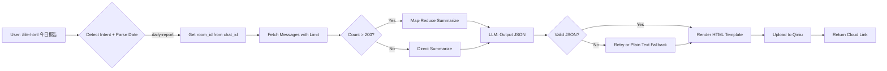

# Daily Visualized Report Generation - Implementation Plan

## Overview

Implement scenario from `11_mixed_scenarios.md:97`:
```
User: @gemini /file-html Based on today's group chat, generate an HTML report for me.
```

---

## Gap Analysis (Team Validated)

| Component | Status | Notes |
|-----------|--------|-------|
| Archive DB + Sync | ✅ Exists | `chat_history.db`, 2700+ messages |
| Archive Viewer API | ✅ Exists | `/archive/api/messages` but for frontend only |
| `/file-html` command | ✅ Exists | Sets `file_output_mode=True`, uploads to Qiniu |
| **LLM-callable Archive Tool** | ❌ Missing | **Critical gap** |
| Intent detection | ❌ Missing | Need to detect "daily report" intent |

---

## Minimum Implementation Path



---

## Team Review Fixes (v2)

### 🔴 HIGH: Context Budget Overflow

**Problem**: Injecting raw messages can exceed 8k chars / 20-turn limit.

**Fix**: Implement hard cap + Map-Reduce before injection.

```python
MAX_CONTEXT_CHARS = 6000  # Leave 2k for prompt + output
MAX_DIRECT_MESSAGES = 100  # Above this, use Map-Reduce

def prepare_archive_context(messages: list[dict]) -> str:
    if len(messages) > MAX_DIRECT_MESSAGES:
        # Map-Reduce: Summarize in 50-msg batches, then merge
        return _map_reduce_summarize(messages, batch_size=50)
    else:
        # Direct: Format and truncate to MAX_CONTEXT_CHARS
        formatted = format_messages(messages)
        return formatted[:MAX_CONTEXT_CHARS]
```

### 🟡 MEDIUM: room_id Access Control

**Problem**: No mapping from chat_id to room_id; risk of cross-group data leakage.

**Fix**: Add explicit access control in Archive Tool.

```python
def get_archive_messages(requester_chat_id: str, date: str = "today", limit: int = 500) -> list[dict]:
    """
    SECURITY: room_id is derived from requester_chat_id.
    The Archive Tool can ONLY access messages from the same room
    where the request originated. Cross-group queries are prohibited.
    
    Mapping: chat_id == room_id (for group chats)
             chat_id == sender+receiver pair (for 1:1 chats, NOT SUPPORTED)
    """
    # Check if this is a group chat (room_id starts with "wr" in WeCom)
    if not requester_chat_id.startswith("wr"):
        raise ValueError("Daily report is only supported in group chats. 1:1 chats are not supported.")
    
    room_id = requester_chat_id  # Same value in WeCom group context
    # Query only WHERE room_id = ?
```

### 🟡 MEDIUM: Output JSON Size Cap

**Problem**: LLM may return huge JSON (many topics + msgids), exceeding output limits.

**Fix**: Add hard caps in system prompt and post-processing.

```python
# Caps for JSON output
MAX_TOPICS = 10
MAX_TODOS = 20  
MAX_MSGIDS_TOTAL = 50
MAX_SUMMARY_CHARS = 500  # Per topic/todo summary

# In system prompt:
REPORT_SYSTEM_PROMPT = """
Generate a JSON report with these STRICT LIMITS:
- Maximum 10 topics
- Maximum 20 todos
- Maximum 50 msgid references total
- Each summary must be under 500 characters
"""

# Post-processing validation:
def validate_and_truncate_report(report: dict) -> dict:
    report["topics"] = report.get("topics", [])[:MAX_TOPICS]
    report["todos"] = report.get("todos", [])[:MAX_TODOS]
    
    # Count and cap msgids across all sections
    total_msgids = 0
    for topic in report["topics"]:
        remaining = MAX_MSGIDS_TOTAL - total_msgids
        topic["msgids"] = topic.get("msgids", [])[:remaining]
        total_msgids += len(topic["msgids"])
    
    return report
```

### 🟡 MEDIUM: JSON Parsing Fallback

**Problem**: No error handling if LLM outputs invalid JSON.

**Fix**: Add retry + fallback path.

```python
def parse_report_json(llm_output: str) -> dict | None:
    try:
        # Try to extract JSON from markdown code block
        json_match = re.search(r'```json\s*(.*?)\s*```', llm_output, re.DOTALL)
        if json_match:
            return json.loads(json_match.group(1))
        return json.loads(llm_output)
    except json.JSONDecodeError:
        return None

# In main flow:
report_json = parse_report_json(llm_response)
if report_json is None:
    # Retry once with stricter prompt
    report_json = retry_with_json_prompt(messages)
    if report_json is None:
        # Fallback: Use plain text summary
        return render_plain_text_report(llm_response)
```

### 🟡 MEDIUM: Date Scope Parsing

**Problem**: Intent detection doesn't handle date ranges; defaults may be wrong.

**Fix**: Explicit date parsing rules.

```python
def parse_report_date_range(user_input: str) -> tuple[str, str]:
    """
    Parse date range from user input.
    Returns (start_date, end_date) in YYYY-MM-DD format.
    
    Rules:
    - "today" / "今天" / "daily" → today only
    - "yesterday" / "昨天" → yesterday only  
    - "this week" / "本周" → Monday to today
    - "last week" / "上周" → Previous Monday to Sunday
    - No date specified → DEFAULT TO TODAY (not ambiguous range)
    """
    today = datetime.now().date()
    
    if any(kw in user_input.lower() for kw in ['yesterday', '昨天']):
        d = today - timedelta(days=1)
        return (d.isoformat(), d.isoformat())
    elif any(kw in user_input.lower() for kw in ['this week', '本周']):
        start = today - timedelta(days=today.weekday())
        return (start.isoformat(), today.isoformat())
    # ... more rules
    else:
        # DEFAULT: Today only (explicit, not ambiguous)
        return (today.isoformat(), today.isoformat())
```

---

## Proposed Changes (Updated)

### Phase 1: Archive Tool Function

#### [NEW] `src/crewai_enterprise/tools/archive/archive_tool.py`

```python
def get_archive_messages(
    requester_chat_id: str,  # Access control: can only query own room
    date: str = "today",
    limit: int = 500
) -> list[dict]:
    """
    Retrieve archived messages for LLM consumption.
    SECURITY: room_id is derived from requester_chat_id.
    """
```

### Phase 2: Intent Detection + Date Parsing

#### [MODIFY] `aibot_callback.py` - `/file-html` handler

```python
if _detect_daily_report_intent(args):
    start_date, end_date = parse_report_date_range(args)
    messages = get_archive_messages(chat_id, date_range=(start_date, end_date))
    context = prepare_archive_context(messages)  # With budget cap + Map-Reduce
```

**Intent keywords**: `daily`, `today`, `yesterday`, `week`, `报告`, `总结`, `今天`, `昨天`, `本周`, `群聊`

### Phase 3: JSON-First Output with Fallback

1. LLM outputs structured JSON
2. Parse with `parse_report_json()`
3. If invalid: Retry once with stricter prompt
4. If still invalid: Fallback to plain text summary

---

## Optimization Strategies (Team Approved)

| Strategy | When to Use | Implementation |
|----------|-------------|----------------|
| **Context Cap** | Always | 6000 chars max, truncate oldest first |
| **Map-Reduce** | >100 messages | Split into 50-msg chunks, summarize each, then merge |
| **Cache daily summary** | Same day, same room | Store in `archive_summary` table, TTL=24h |
| **JSON retry** | Parse failure | Retry once with explicit JSON prompt |
| **Plain text fallback** | JSON retry fails | Render basic text summary |

---

## File Changes Summary

| File | Action | Description |
|------|--------|-------------|
| `tools/archive/archive_tool.py` | NEW | Archive retrieval with access control |
| `utils/report_date_parser.py` | NEW | Date range parsing |
| `utils/context_budget.py` | NEW | Map-Reduce + truncation |
| `aibot_callback.py` | MODIFY | Intent detection + context injection |
| `templates/daily_report.html` | NEW | Jinja2/Tailwind template |
| `utils/report_generator.py` | NEW | JSON → HTML renderer with fallback |

---

## Implementation Order

1. [ ] **Archive Tool** - `get_archive_messages()` with room_id access control
2. [ ] **Date Parser** - `parse_report_date_range()` with explicit defaults
3. [ ] **Context Budget** - `prepare_archive_context()` with Map-Reduce
4. [ ] **Intent Detection** - `_detect_daily_report_intent()` helper
5. [ ] **JSON Parser** - `parse_report_json()` with retry + fallback
6. [ ] **HTML Template** - Tailwind + Chart.js template
7. [ ] **Renderer** - JSON → HTML conversion
8. [ ] **Test** - End-to-end with real group chat
