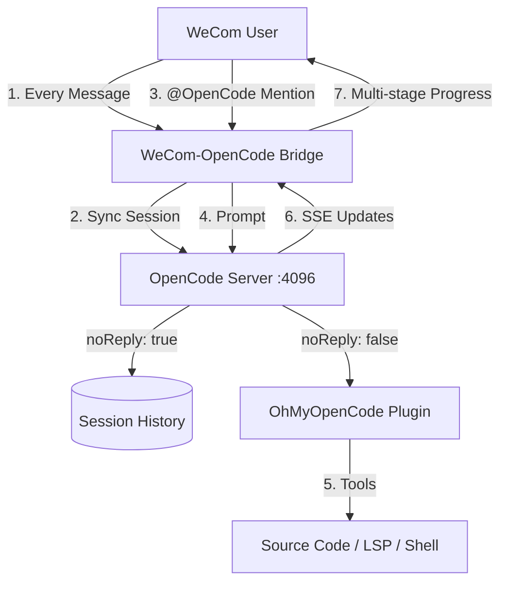

# WeCom + OpenCode & OhMyOpenCode (OMO) Integration Plan

## Big Picture (Why This Exists)
We are moving from “calling OpenCode from WeCom” to **bringing WeCom into OpenCode**.
The goal is a resident AI teammate that understands ongoing team context without manual lookbacks.
To achieve this, the bridge **silently syncs all WeCom messages** into OpenCode (`noReply: true`),
and only triggers reasoning when `@OpenCode` is mentioned.

This approach:
- **Preserves continuity** across long, messy team discussions.
- **Eliminates bridge-side context juggling** (no custom truncation windows).
- **Leverages OpenCode’s native session compaction** for intelligent summarization.

## Intention and Purpose
To provide a high-IQ, multi-agent AI coding assistant directly within enterprise communication channels (WeCom). 

Instead of maintaining a complex, custom-coded agent framework (like CrewAI), we will leverage the **OpenCode + OMO** ecosystem. This approach enables:
- **Expert Collaboration**: Parallel subagents (Oracle for arch, Librarian for docs) working together.
- **Maintenance-Free Upgrades**: Automatic access to the latest frontier models and agent strategies.
- **Enterprise Ready**: Headless server architecture with professional session management.

## Architecture: The Native Sync Strategy

We will implement a non-breaking, modular bridge that follows the "High-IQ Bot" pattern used by Gemini and Grok.



## Modular Safety & Compatibility

> [!IMPORTANT]
> - **Isolated Modules**: The OpenCode integration will live in its own files (`opencode_handler.py`, `opencode_bridge.py`). It will **not** modify the core logic of existing bots (Gemini, ChatGPT, Grok).
> - **Dedicated Bot Identity**: Use a single WeCom bot named **OpenCode**, routed to a new handler to avoid collisions with existing `/1d`, `/file-html`, etc.
> - **Internal Context Management**: OpenCode manages its own sliding window and history compaction. The bridge simply feeds it messages.
> - **Privacy/Consent**: In monitored chats, all messages are synced to OpenCode (noReply) even without @mentions.

## Target User Experience (UX)

| Stage | User Action | System Response |
|-------|-------------|-----------------|
| **Passive Learning** | Users chat normally in WeCom. | (None) Bridge silently syncs messages to OpenCode history. |
| **Trigger** | Mention `@OpenCode` or send a bug report. | Immediate ACK: "Sisyphus is analyzing your request..." |
| **Orchestration** | (None) | Real-time status updates: "Oracle is debugging logic..." |
| **Lifecycle** | `/plan` -> `/start-work` | Transitions from planning (Prometheus) to execution (Atlas). |
| **Completion** | (None) | A comprehensive report or code fix is posted back to the group. |

## Technical Implementation Details

### 1. The Core: OpenCode Server
- **Runtime**: `Bun` (required for OpenCode's TypeScript execution).
- **Mode**: `opencode serve --port 4096`.
- **Plugin**: Load OhMyOpenCode as a primary orchestration layer.

### 2. The Bridge: WeCom Callback Service
We will build a Python/FastAPI bridge to handle the following:
- **Trigger-Driven Context Catch-up**: Since standard WeCom bots cannot perceive non-mention messages in real-time, the bridge will:
  - **Force Sync**: Trigger `archive_sync_worker` immediately upon a bot mention.
  - **Lazy Catch-up**: Fetch missing history from the Archive since the last sync bookmark and feed it to OpenCode via `prompt_async(noReply: true)`.
- **Session Mapping**: Use WeCom `chat_id` as the session key for both group and 1:1 chats.
- **Memory Scope**: No cross-chat user memory in Phase 1 (privacy + task clarity).
- **SSE Stream Listener**: Capture subagent activity and push real-time status messages using an **Aggregator/Throttler** (batching updates every 10s).
- **Routing Isolation**: OpenCode bot uses a dedicated handler. Do NOT run legacy command parsing for this bot.
  - **Aggregation (Efficiency)**: For historical backfills, aggregate up to **50-100 messages** into a single OpenCode "Transcript" message with `noReply: true`. This drastically reduces API calls and initialization time.
  - **Bookmark System**: Track `last_synced_ts` per chat to ensure differential sync integrity.
  - **Manual override**: add `/resync <range>` for admins.
- **SSE Status Aggregator**:
  - **Immediate first update**: Send the first status instantly (no delay) so users see progress.
  - **Throttling**: Cache subagent "thought" events; broadcast a single consolidated "Status" message to WeCom every 10 seconds.
  - **Flush on completion/errors**: Always flush immediately when a task finishes or errors.
  - **Priority events**: Approval requests and blocking errors bypass the throttle.
  - **Aggregation**: Map multiple parallel subagents (Oracle, Librarian, etc.) into one status line: *"Librarian searching docs | Oracle designing refactor..."*
  - **Length cap**: Limit status text (e.g., 200–300 chars) with truncation.
  - **De-dupe**: Ignore repeated identical status from the same subagent.

### 2.5 Stability Guardrails (Production)
These are **required** to avoid busy-session loops, short replies, and partial `/file-html` output.
- **Do NOT send `messageID`** on interactive prompts. Let OpenCode generate ordered IDs.
- **Abort-if-busy** before new prompts; if still busy, return a clear busy message.
- **`/force`** command: abort busy sessions and proceed; fallback to new session if still busy.
- **Response completeness**:
  - `max_wait = 280s` (WeCom limit ~300s)
  - `response_stable_timeout = 20s`
  - Skip short/lead-in responses and prefer the **longest assistant text** after our user prompt.
- **/file-html**:
  - Wait for session idle (up to 280s)
  - Match assistant text by **request time + content** before generating HTML
  - Upload to Qiniu and send link only

### 2.2 Aggregated Backfill Transcript Format
When backfilling large gaps, the bridge should send aggregated transcript chunks rather than individual messages.
This preserves signal while reducing API calls.

**Chunking rules**:
- **Size cap**: 20–30k chars per transcript chunk.
- **Message cap**: 50–100 messages per chunk.
- **Time cap**: 10–30 minute windows (whichever limit hits first).

**Transcript template** (sent with `noReply: true`):
```
[Transcript Backfill]
range=2026-01-25 10:00–10:30
count=78
participants=alice,bob,carol
- [10:02] alice: deployed hotfix
- [10:05] bob: error in payments handler: NullRef ...
- [10:08] carol: attached log file: payments.log (storage_key=...)
...
```

**File handling during backfill**:
- If files exist, include metadata + storage_key.
- If extracted text exists, include a short snippet (<= 1–2k chars) or a pointer.

- Track `last_synced_msg_id` + `last_synced_ts` per chat to avoid re-sending backfilled messages.
- **OCR Source**: Pull extracted text from the `file_contents` table within `chat_storage.db`.

## Bridge Implementation Checklist

### Core Routing
- **Bot Identity**: OpenCode bot only; isolated handler (no legacy bot command parsing).
- **Trigger Rules**: Sync all messages with `noReply: true`. Only respond on `@OpenCode` or slash commands.
  - **Slash Commands**: Only honored if `@OpenCode` is mentioned in the same message or if the conversation is in a 1:1 private chat.
- **Command Dispatch**: `/plan`, `/start-work`, `ulw`, `/ralph-loop`, `/cancel-ralph`, `/reset`, `/resync`, `/force`, `/file-html`.

### Session & State
- **Session Key**: `chat_id` for both groups and 1:1 chats.
- **Memory Boundary**: Per-chat isolation (no cross-chat user context in Phase 1).
- **Reset Semantics**: `/reset` creates new session pointer; keep old session for audit.
- **Dedup Store**: Cache `msg_id` per chat (Redis or SQLite).
- **Last Sync Marker**: Track `last_synced_ts` + `last_synced_msg_id`.

### Message Sync
- **Payload Schema**:
  - `session_id`, `msg_id`, `timestamp`, `sender_id`, `sender_name`, `msg_type`, `content`
  - file metadata: `filename`, `mime_type`, `storage_key`, `size_bytes`
- **Ordering**: Sort by `(msgtime, seq)` or fallback `(msgtime, msg_id)` before sending.
- **Filtering**: Exclude other AI bots by default; include only on explicit user quote.

### Backfill
- **On Boot**: Backfill last 6h aggregated transcripts.
- **On Gap**: If `now - last_synced_ts > 10m`, backfill missing range (aggregated).
- **Manual**: `/resync <range>` (admin-only).
- **Transcript Chunking**: size/message/time caps as defined above.

### SSE Status Aggregator
- **Immediate First Update**: send instantly.
- **Throttle**: aggregate every 10s.
- **Priority Flush**: completion, errors, approval requests.
- **Dedup/Truncate**: drop repeats, cap length.

### Files & OCR
- **Sync Metadata**: always.
- **Extracted Text**: only if small; otherwise summary or pointer.
- **Quoted Files**: include extracted snippets to improve accuracy.

### Observability
- **Metrics**: sync rate, dedup hits, backfill size, SSE updates per task.
- **Logs**: per-chat session id, last sync marker, backfill ranges.
- **Health**: OpenCode server reachability, queue backlog.

## Sync Payload Schema (OpenCode SDK v2)

OpenCode uses **session prompt APIs** with `parts`. For native sync, use
`/session/{sessionID}/prompt_async` with `noReply: true`.

### API Endpoints (Required)
- `POST /session/{sessionID}/prompt_async` → **silent sync** (noReply=true)
- `POST /session/{sessionID}/message` → **interactive prompt** (noReply=false)
- `POST /session/{sessionID}/command` → **OMO commands** (/plan, /start-work, /ralph-loop, etc.)

### 1) Async Sync (noReply=true)
```json
{
  "path": { "sessionID": "chat_or_user_session_key" },
  "query": { "directory": "/repo/path" },
  "body": {
    "messageID": "wecom_msg_id",
    "agent": "sisyphus",
    "noReply": true,
    "parts": [
      {
        "type": "text",
        "text": "[10:05] alice: deployed hotfix",
        "metadata": {
          "chat_id": "wrQakDCg...",
          "sender_id": "alice",
          "sender_name": "Alice",
          "msg_type": "text"
        },
        "time": { "start": 1705555555 }
      }
    ]
  }
}
```

### 2) Interactive Prompt (noReply=false)
```json
{
  "path": { "sessionID": "chat_or_user_session_key" },
  "query": { "directory": "/repo/path" },
  "body": {
    "agent": "sisyphus",
    "noReply": false,
    "parts": [
      { "type": "text", "text": "@OpenCode analyze the bug in payments" }
    ]
  }
}
```

### 3) Commands (OMO)
```json
{
  "path": { "sessionID": "chat_or_user_session_key" },
  "query": { "directory": "/repo/path" },
  "body": {
    "messageID": "wecom_msg_id",
    "command": "start-work",
    "arguments": "plan-name",
    "agent": "sisyphus"
  }
}
```

### Part Types (from SDK v2)
- **TextPartInput**: `{ type: "text", text, time?, metadata?, synthetic?, ignored? }`
- **FilePartInput**: `{ type: "file", mime, url, filename?, source? }`
- **AgentPartInput**: `{ type: "agent", name, source? }` (Used for routing to subagents)
- **SubtaskPartInput**: `{ type: "subtask", prompt, description, agent, model?, command? }`

> [!NOTE]
> **Orchestration Principle**: Use the top-level `agent` field in the request body for the primary orchestrator (default: `sisyphus`). Avoid overriding the top-level agent field unless explicitly requested; use `AgentPartInput` within the `parts` array for sub-agent delegation.

## Bridge Handler Flow (Pseudo-code)
```
on_message(msg):
  session_id = select_session_key(msg)
  
  if is_open_code_trigger(msg):
    # [NEW] Force catch-up for human-to-human chats (Cold context)
    trigger_archive_sync() 
    
    parts = normalize_parts(msg)
    send_prompt(session_id, parts, no_reply=false)
    start_sse_aggregator(session_id)
  else:
    # WeCom only sends bot-mentions to callback, so non-mentions are not handled here.
    pass

on_boot():
  backfill_range = last_6_hours
  aggregated = build_transcripts(backfill_range)
  send_aggregated_backfill(aggregated, noReply=true)

on_gap_detected():
  backfill_missing_range()
```

## Operational Runbook (Minimal)
- **Bootstrap**
  - Start OpenCode server
  - Start WeCom bridge
  - Run backfill for last 6h (aggregated)
- **Resync**
  - Admin runs `/resync 6h` or `/resync 1d`
  - Bridge backfills aggregated transcripts
- **Reset**
  - `/reset` creates a new session pointer for the chat
- **Diagnostics**
  - Check OpenCode health endpoint
  - Inspect dedup cache size
  - Confirm last_synced_ts advancing

## Implementation Outline (Python Skeleton)
```python
class OpenCodeBridge:
    def __init__(self, opencode_url: str, archive_client, dedup_store):
        self.opencode_url = opencode_url
        self.archive = archive_client
        self.dedup = dedup_store
        self.sse = SSEStatusAggregator()

    def select_session_key(self, msg) -> str:
        return msg.chat_id if msg.is_group else msg.user_id

    def is_dedup(self, msg) -> bool:
        return self.dedup.seen(msg.chat_id, msg.msg_id)

    def normalize_parts(self, msg) -> list[dict]:
        # Build TextPartInput/FilePartInput from message + metadata
        return build_parts(msg)

    def send_prompt_async(self, session_id: str, parts: list[dict], message_id: str):
        return post_prompt_async(self.opencode_url, session_id, parts, message_id, no_reply=True)

    def send_prompt(self, session_id: str, parts: list[dict]):
        # Do NOT send messageID for interactive prompts.
        return post_prompt(self.opencode_url, session_id, parts, no_reply=False)

    def send_command(self, session_id: str, command: str, arguments: str, message_id: str):
        return post_command(self.opencode_url, session_id, command, arguments, message_id)

    def backfill(self, chat_id: str, start_ts: int, end_ts: int):
        messages = self.archive.fetch(chat_id, start_ts, end_ts)
        chunks = build_transcript_chunks(messages)
        for chunk in chunks:
            self.send_prompt_async(self.select_session_key(chat_id), [chunk], message_id=chunk["metadata"]["chunk_id"])


class SSEStatusAggregator:
    def __init__(self, interval_sec: int = 10):
        self.interval_sec = interval_sec

    def on_event(self, session_id: str, event: dict):
        # Cache + throttle; flush immediately on error/completion/approval
        pass
```

## OpenCode HTTP Client (Requests Stub)
```python
import requests

class OpenCodeClient:
    def __init__(self, base_url: str, api_key: str | None = None):
        self.base_url = base_url.rstrip("/")
        self.session = requests.Session()
        if api_key:
            self.session.headers.update({"Authorization": f"Bearer {api_key}"})

    def prompt_async(self, session_id: str, parts: list[dict], message_id: str, no_reply: bool = True, directory: str | None = None):
        url = f"{self.base_url}/session/{session_id}/prompt_async"
        body = {"messageID": message_id, "noReply": no_reply, "parts": parts}
        params = {"directory": directory} if directory else None
        return self.session.post(url, json=body, params=params, timeout=15)

    def prompt(self, session_id: str, parts: list[dict], no_reply: bool = False, directory: str | None = None):
        url = f"{self.base_url}/session/{session_id}/message"
        # Do NOT send messageID for interactive prompts (avoid ID ordering bugs).
        body = {"noReply": no_reply, "parts": parts}
        params = {"directory": directory} if directory else None
        return self.session.post(url, json=body, params=params, timeout=60)

    def command(self, session_id: str, command: str, arguments: str, message_id: str, directory: str | None = None):
        url = f"{self.base_url}/session/{session_id}/command"
        body = {"messageID": message_id, "command": command, "arguments": arguments}
        params = {"directory": directory} if directory else None
        return self.session.post(url, json=body, params=params, timeout=60)
```

## WeCom → OpenCode Metadata Mapping
Map WeCom fields into `TextPartInput.metadata` for traceability:

- `chat_id` → group id
- `msg_id` → WeCom MsgId
- `msg_time` → `time.start` (unix seconds)
- `sender_id` / `sender_name`
- `msg_type` (text/image/file/mixed)
- `mentions` (array of mention targets)
- `storage_key` / `filename` / `mime_type` / `size_bytes`
- `quoted_msg_id` (if quote is present)

Example `TextPartInput`:
```json
{
  "type": "text",
  "text": "[10:05] alice: deployed hotfix",
  "time": { "start": 1705555555 },
  "metadata": {
    "chat_id": "wrQakDCg...",
    "msg_id": "abcdefg123",
    "sender_id": "alice",
    "sender_name": "Alice",
    "msg_type": "text",
    "mentions": ["OpenCode"]
  }
}
```

## Unit-Test Plan (Bridge)
- **Dedup**: same `msg_id` should not be sent twice.
- **Ordering**: out-of-order inputs should be sorted before aggregation.
- **Trigger**: `@OpenCode` should switch to `noReply=false`.
- **Backfill**: `/resync 1h` should emit aggregated transcripts only.
- **Session Keying**: group → `chat_id`, private → `user_id`.
- **Files**: file metadata included; large file text truncated.
- **SSE Aggregator**: first update immediate; throttled updates every 10s; flush on completion/error.

## Implementation Appendix (Coding-Ready)

### A) API Contract (HTTP)
**Headers**
- `Authorization: Bearer <token>` (if enabled)
- `Content-Type: application/json`

**Endpoints**
- `POST /session/{sessionID}/prompt_async` → 204 on accept
- `POST /session/{sessionID}/message` → 200 with assistant message
- `POST /session/{sessionID}/command` → 200 with assistant message

**Retries**
- `prompt_async`: retry up to 3 times (2s, 5s, 10s) on network/5xx
- `message/command`: no auto-retry unless idempotency guaranteed

**Timeouts**
- `prompt_async`: 15s
- `message/command`: 60s

### B) Canonical Schemas (Pseudo)
```python
class WeComInbound(BaseModel):
    msg_id: str
    chat_id: str
    user_id: str
    user_name: str
    msg_time: int
    msg_type: Literal["text","image","file","mixed"]
    text: str | None
    file: FileMeta | None
    mentions: list[str] = []
    quoted_msg_id: str | None = None

class OpenCodePart(BaseModel):
    type: Literal["text","file","agent","subtask"]
    text: str | None
    mime: str | None
    url: str | None
    filename: str | None
    metadata: dict | None

class BackfillChunk(BaseModel):
    chunk_id: str
    range_start: int
    range_end: int
    message_count: int
    text: str
```

### C) State Storage (Minimal)
- **Dedup store**: `dedup:{chat_id}` (set of msg_id, TTL 7d)
- **Session pointer**: `session:{chat_id}` → active session id
- **Last sync**: `lastsync:{chat_id}` → timestamp + msg_id

### D) Backfill Algorithm (Summary)
```
fetch archive messages in [start, end]
sort by (msg_time, seq, msg_id)
filter out msg_id already in dedup
chunk by (count<=100) or (chars<=30k) or (window<=30m)
for each chunk:
  build Transcript Backfill text
  send prompt_async(noReply=true)
```

### E) Command Parsing Rules
- `@OpenCode` anywhere in message → OpenCode interaction
- Slash commands only honored if OpenCode is mentioned or in 1:1
- Agent tags: `@OpenCode @Oracle ...` → agent part
- `/reset` → new session pointer (do not delete old)
- `/resync <range>` → aggregated backfill (admin only)

### F) Failure Handling Matrix
| Failure | Behavior |
|---|---|
| OpenCode down | queue sync, retry; if trigger, respond with “temporarily unavailable” |
| Archive down | skip backfill, log warning |
| SSE stream drops | reconnect with backoff; resume aggregation state |
| Dedup store down | fallback to in-memory dedup (short TTL) |

### G) Test Fixtures
- **Text message**: includes @OpenCode trigger and agent tag.
- **File message**: metadata + extracted snippet.
- **Out-of-order messages**: ensure stable sort.
- **Backfill chunk**: verify Transcript format and caps.

## Interface & Method Signatures (Reference)

### Bridge Core (Python)
```python
class BridgeConfig(BaseModel):
    opencode_url: str
    opencode_token: str | None = None
    archive_db_path: str
    sync_backfill_hours: int = 6
    gap_threshold_sec: int = 600
    status_interval_sec: int = 10

class OpenCodeBridge:
    def __init__(self, config: BridgeConfig, archive_client, dedup_store, session_store):
        ...

    def handle_inbound(self, msg: WeComInbound) -> None:
        """Entry point for every WeCom message."""

    def normalize_parts(self, msg: WeComInbound) -> list[dict]:
        """Map WeCom message to OpenCode part list."""

    def should_trigger(self, msg: WeComInbound) -> bool:
        """True if @OpenCode or slash-command in 1:1."""

    def send_sync(self, session_id: str, parts: list[dict], message_id: str) -> None:
        """Send prompt_async(noReply=true)."""

    def send_interactive(self, session_id: str, parts: list[dict], message_id: str) -> None:
        """Send message(noReply=false)."""

    def send_command(self, session_id: str, command: str, arguments: str, message_id: str) -> None:
        """Send OMO command."""

    def backfill(self, chat_id: str, start_ts: int, end_ts: int) -> None:
        """Aggregated backfill using prompt_async(noReply=true)."""

    def reset_session(self, chat_id: str) -> str:
        """Create and store new session pointer."""
```

### Storage Interfaces
```python
class DedupStore(Protocol):
    def seen(self, chat_id: str, msg_id: str) -> bool: ...
    def mark(self, chat_id: str, msg_id: str) -> None: ...

class SessionStore(Protocol):
    def get(self, chat_id: str) -> str | None: ...
    def set(self, chat_id: str, session_id: str) -> None: ...
    def rotate(self, chat_id: str) -> str: ...

class SyncStateStore(Protocol):
    def get_last(self, chat_id: str) -> tuple[int, str] | None: ...
    def set_last(self, chat_id: str, ts: int, msg_id: str) -> None: ...
```

## Expanded Unit Test Matrix

### Parsing & Routing
- Detect `@OpenCode` in text, mixed, and quoted messages.
- Slash commands only honored for OpenCode bot or in 1:1.
- Agent tags parsed: `@OpenCode @Oracle` → AgentPartInput.
- `/reset` creates new session pointer and does not delete history.

### Dedup & Ordering
- Duplicate `msg_id` ignored (text, file, mixed).
- Out-of-order messages sorted correctly before backfill chunking.
- Dedup survives restart using persistent store.

### Backfill
- Gap detection triggers aggregated backfill.
- Chunking respects max messages, max chars, and time window.
- No duplicate backfill when last_synced markers are set.

### Sync Payload Integrity
- TextPartInput includes metadata fields.
- FilePartInput includes mime/url/filename and omits huge text.
- OCR snippet truncated to limit.

### SSE Status Aggregator
- First update immediate.
- Throttle at 10s.
- Flush on completion/error/approval.
- Dedup repeated status from same agent.
- Length cap enforced.

### Failure Modes
- OpenCode 5xx → retry prompt_async; no retry for interactive unless idempotent.
- Archive unreachable → log + skip backfill.
- Dedup store unavailable → fallback to in-memory dedup with short TTL.

## Minimal Integration Tests
- Start bridge + mock OpenCode server; send 3 sync messages; verify `prompt_async` calls.
- Send @OpenCode message; verify `message` call and SSE stream passthrough.
- Trigger `/resync 1h`; verify aggregated transcript payload.

### 3. SOTA Model Configuration (January 2026)
Based on current benchmarks (Jan 2026), we will use:
- **Sisyphus (Main Orchestrator)**: **Claude Opus 4.5** (Released Nov 2025). Best-in-class for agency, tool-use steering, and code integrity.
- **Oracle (Architecture & Planning)**: **GPT-5.2 Codex** (Released Dec 2025). Optimized for large-scale refactoring and cybersecurity analysis.
- **Librarian (Documentation & Implementation Research)**: **Claude Sonnet 4.5** (Released Sept 2025). Fast, high context (1M token beta), and surgical search capabilities.
- **Subagents (Background Analysis)**: **Gemini 3 Flash** (Released Dec 2025). Multimodal Pro-grade reasoning at sub-second speeds.

## Expected Results
- **Latency**: 30-60s for complex tasks, with sub-second feedback via status messages.
- **Context Integrity**: The agent has native access to all human discussion preceding a task.
- **Efficiency**: Leverage OpenCode's internal history management (compaction).

## Versioning & Customization Strategy

### OpenCode Server (CLI/NPM Global)
- **Install**: Global install for stable infra and easy upgrades.
- **Pin version**: Avoid always-latest; upgrade on a controlled cadence.
- **Rationale**: Keeps server stable while allowing planned upgrades.

### OhMyOpenCode (OMO) Source Deployment
- **Use Git clone (or fork)** to allow prompt and agent modifications.
- **Target edits**: `src/agents/*.ts` for prompt tuning.
- **Rationale**: Allows fast adaptation to WeCom Markdown rendering and dual-mention routing.

### Bridge-Level Adaptation (Preferred for Rendering)
- **WeCom Markdown quirks** should be handled in the bridge when possible.
- **Prompt edits** should focus on agent behavior, not output formatting.

## Verification Plan
1. **Sync Test**: Send a normal WeCom message and verify it appears in OpenCode's message storage without any server-side LLM call.
2. **Brain Test**: Mention `@OpenCode` after 5-10 human messages and verify the agent's response acknowledges the previous human context.
3. **Compaction Test**: Fill a session with 100+ messages and verify OpenCode's `SessionCompaction` triggers automatically.
